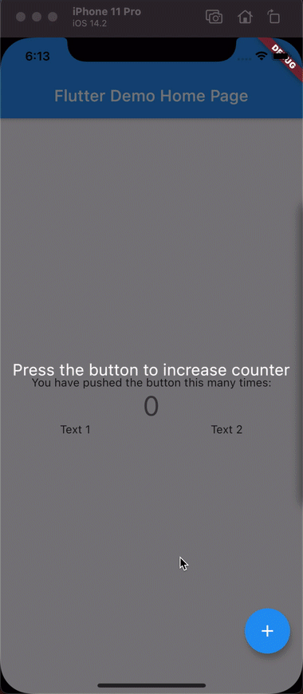
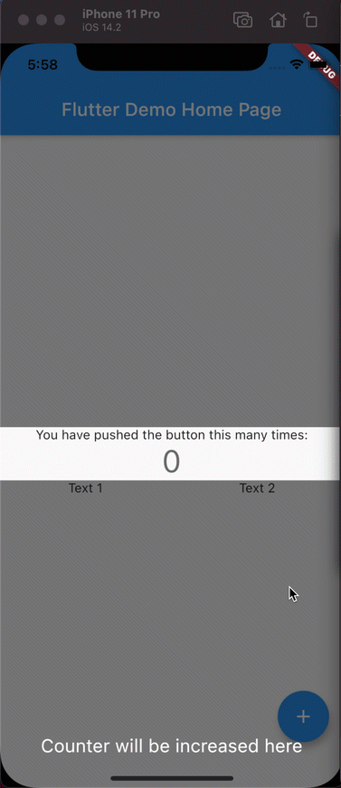
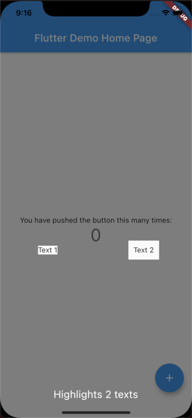
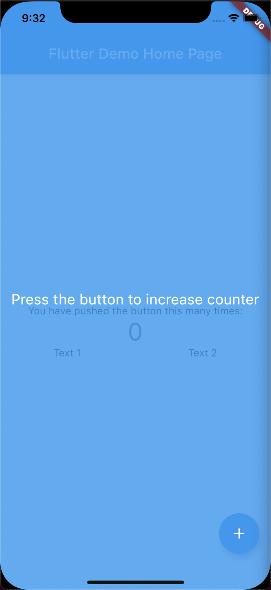

# flutter_tutorial

Provides a Tutorial API to displat tutorial overlay and highlights certain items.

## Counter example



1. Create global keys and pass them to widgets you want to highlight.

```dart
  static final _buttonKey = GlobalKey();
  static final _textKey = GlobalKey();

  ...
  Column(
    key: _textKey,
    ...
  FloatingActionButton(
    key: _buttonKey,
    ...
```

2. Create tutorial entries

Use `getBasicRect` or `getBasicRRect` methods to get the area to highlight from the key.

```dart
final tutorialEntries = [
    ExampleTutorialEntry(
        [
            RRect.fromRectAndRadius(
                getBasicRect(_buttonKey),
                const Radius.circular(28),
            )
        ],
        'Press the button to increase the counter',
        Alignment.center,
    ),
    ExampleTutorialEntry(
        [getBasicRRect(_textKey)],
        'Counter will be increased here',
        Alignment.bottomCenter,
    ),
];
```

3. Create tutorial dialog

```dart
class TutorialEntryWidget extends StatelessWidget {
    const TutorialEntryWidget({Key? key, required this.entry}) : super(key: key);

    final ExampleTutorialEntry entry;

    @override
    Widget build(BuildContext context) {
        return Align(
            alignment: entry.alignment,
            child: SafeArea(
                child: Material(
                    color: Colors.transparent,
                    child: Text(
                        entry.text,
                        style: const TextStyle(
                            fontSize: 20,
                            color: Colors.white,
                        ),
                    ),
                ),
            ),
        );
    }
}
```

4. Start the tutorial.

```dart
Tutorial().show<ExampleTutorialEntry>(
    context,
    children: tutorialEntries,
    onPressedBehavior: OnPressedBehavior.next,
    dialogBuilder: (context, index, next, previous) {
        final entry = tutorialEntries[index];
        return TutorialEntryWidget(entry: entry);
    },
);
```

## Other info

### Providing more than 1 widget to highlight

You can provide more than 1 widget to highlight and it'll still animate without any issues.



### OnPressedBehavior

OnPressedBehavior specifies what action should be taken when pressed outside of the dialog: 

- close
- next
- none

### next, previous methods in dialogBuilder

You can use next and previous methods in dialogBuilder to add cutom buttons that skip forward or backwards.

### prepareNext

Place to define any animations before moving to next slide. (useful when using OnPressedBehavior.next).

### Creating bigger highlights than widgets

You can inflate Rect or RRect class to make the highlight area bigger, or deflate them to be smaller if needed without changing the layout of your widgets.

```dart
RRect.fromRectAndCorners(
    getBasicRect(_text2Key).inflate(10),
);
```



### Changing overlay background color and opacity

Background color and it's opacity can be easily adjusted to your needs.

```dart
    backgroundColor: Colors.blue,
    backgroundMaxOpacity: 0.8,
```


